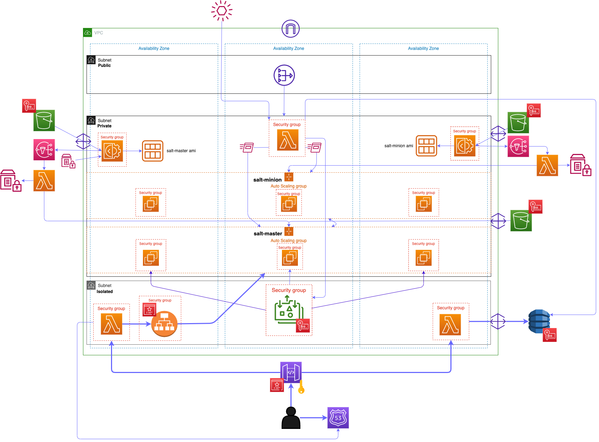

# aws-multimaster-saltstack

## Intro

This is a demo project, creating an infrastructure in [aws (amazon web services)](https://aws.amazon.com/) using [CDK (cloud development kit) v2](https://docs.aws.amazon.com/cdk/v2/guide/home.html) in [Typescript](https://www.typescriptlang.org/) to achieve the objective described below

## Objective

secure high available and scalable multi master [SaltStack](https://saltproject.io/) master/minion setup

### Features

- master instances should register/deregister themselves automatically in all minions
- minion instances should register/deregister themselves automatically in all masters
- all master instances are also minions
- `salt-api` should be accessible via an application load balancer isolated in vpc, connecting to all masters
- dynamodb table to collect ec2 instances (master and minion) attributes such as: _minion_id, instance_id, ip address, instance tier, etc..._
- api gateway to access salt-api and dynamodb table data with apikey and api usage plan

> **Security**:
>
> - iam policies and permissions
> - data encryption at rest and in transit (kms key, acm tls certificate)
> - security groups
> - private and isolated subnets with _nat_, _s3_ and _dynamodb_ gateway
> - _custom header_ for application load balancer
> - apikey and usage plan for api gateway
>
> **High Availability and Scale**: auto scaling groups with application load balancer using multiple subnets across multiple availability zones (at least 3) with an event driven architecture to automatically register/deregister nodes

## aws services and tools

here is a brief overview of aws services and tools used in this app

- budgets: _budget alarm_
- vpc: _vpc, subnet, security group, nat gateway, s3 gateway, dynamodb gateway_
- ec2 image builder: _pipeline_ with custom recipe
- iam: _policy, permissions_
- kms: _kms key_ for data encryption at rest _(s3 bucket, dynamodb table, efs)_
- acm: _tls certificate_ for data encryption in transit _(api gateway and application load balancer)_
- dynamodb: _table, ttl, autoscaling_
- ec2: _instance, launch template, ami, target group, autoscaling group, application load balancer_
- ssm: _run command, parameter store, ssm agent (ec2 instance)_
- eventbridge: _event_
- sns: _topic_
- s3: _bucket, bucket policy, lifecycle policy, replication rule_
- route53: _public and private hosted zone, alias record_
- lambda: _layer, function, alias, autoscaling, policy and permissions, integration with: vpc, eventbridge event, sns notification, efs, dynamodb, application load balancer, ssm run command, ssm parameter store, ec2 ami, snapshot, volume, launch template and autoscaling_
- cloudwatch: _cloudwatch agent (ec2 instance)_

## Architecture



## Requirements

### Knowledge

- [SaltStack](https://saltproject.io/)
- aws [CDK](https://docs.aws.amazon.com/cdk/v2/guide/home.html) and [Cloudformation](https://aws.amazon.com/cloudformation/)
- [Typescript](https://www.typescriptlang.org/) language
- [Bash](https://www.gnu.org/software/bash/)

### Tools

- code editor or IDE. ([vscode](https://code.visualstudio.com/))

- [aws account](https://portal.aws.amazon.com/billing/signup?refid=d97c9d89-00ee-48c6-84a2-4f1d2dd976da&redirect_url=https%3A%2F%2Faws.amazon.com%2Fregistration-confirmation#/start/email)

- [aws cli](https://aws.amazon.com/cli/)

- aws profile (aws iam user with admin permissions)

```bash
# check if aws cli is installed
aws --version

# configure profile
aws configure
```

## Deploy

### create `.env` file in project root directory with following entries:

```bash
# required, ex: 123456789012
ACCOUNT_ID=<aws_account_id>

# required, ex: example.com
DOMAIN=<registered_domain_name_associated_with_aws_route53_public_hosted_zone>

# required, ex: iuhfskjbbe87ggjgsd765ajhf765afHJGFSDtasewr76HFJ
API_KEY=<apikey_for_app_api_gateway>

# required, ex: admin
CDK_IAM_USER=<aws_iam_user_with_admin_permissions>

# required, ex: example@example.com
EMAIL=<email_address_for_sns_notifications_and_budget_alarm>

# optional, default: us-east-1
REGION=<aws_region_to_deploy_cdk_app>

# optional, default: saltuser
SALT_API_USER=<username_for_saltapi_user_account>

# optional, default: saltPassword
SALT_API_PASSWORD=<password_for_saltapi_user_account>
```

### install npm packages

```bash
npm install
```

### install aws cdk

```bash
sudo npm install -g aws-cdk
```

### bootstrap cdk

> this is only required, if it's not done before

```bash
cdk bootstrap
```

### synthesize app _(optional)_

> to create and review cloudformation template

```bash
cdk synth > template.yml
```

### deploy app to aws account

```bash
cdk deploy
```

> ```bash
> # make scripts executable
> chmod +x src/scripts/*
> ```

> **NOTE** execute all scripts from project root directory

### copy files to s3 buckets

after app deployment is successfully finished, several files should be copied to s3 buckets. this could be done by executing a script

> **NOTE** check the bucket names and data directory paths in `src/scripts/s3_sync.sh`
> bucket names should be automatically set in the script file during synth process

```bash
bash src/scripts/s3_sync.sh
```

### execute/run ec2 image builder pipelines

when files are successfully copied to s3 buckets, execute the ec2 image builder pipelines to build _salt-master_ and _salt-minion_ ami. this could be also done by executing the following script.

> **NOTE** check the image builder pipeline arn in `src/scripts/imagebuilder_pipeline_exec.sh`
> they should be automatically set in the script file during synth process

```bash
bash src/scripts/imagebuilder_pipeline_exec.sh
```

after about 30-45 minutes image builder pipelines should be done. they will automatically:

- put the created ami id in ssm parameter store
- create a new launch template version with the new ami id and set it as default
- modify the autoscaling groups to use the latest launch template version
- update autoscaling groups instances with new ami
- delete older ami _(images, snapshots, volumes)_

### start salt-master cluster

when deploying the cdk infrastructure app, 2 autoscaling groups for salt-master and salt-minion would be created having the _amazon linux 2_ as ami set in launch template with (min:0, max: 3) capacity, so there should be no instance running from these autoscaling groups at first

> **NOTE** make sure that new ec2 images (ami) are created for both salt-master and salt-minion by ec2 image builder from previous step

change/increase desired or minimum capacity for salt-master autoscaling group to create ec2 instances. in [aws management console](https://signin.aws.amazon.com/)

### start salt-minion cluster

> **NOTE** make sure, that at least 1 salt-master instance is running to accept minions

do the same steps as above for salt-minion autoscaling group

### app api

following 2 api endpoints should be available, which could be tested by executing following script

> **NOTE** `X-API-Key` Header with _apiKey value_ must be set in request, which is done in script

- **GET** `https://<API_DOMAIN_NAME>/instances`
  returns the dynamodb table data containing information about ec2 instances
- **GET** `https://<API_DOMAIN_NAME>/salt`
  returns ping result from `salt-api` of all registered minions
  > **NOTE** it takes some time (about 2-5 minutes) after an ec2 instance comes up or goes down, for the changes to be reflected in masters and minions (register/deregister), namely accepting or deleting the minion key or adding new salt-master ip to salt-minion master ip list

> **NOTE** check the _api domain name_ and _api key_ in `src/scripts/api.sh`
> they should be automatically set in the script file during synth process.
> `curl` package is used in script

```bash
bash src/scripts/api.sh
```

## Destroy/Delete

```bash
cdk destroy
```
